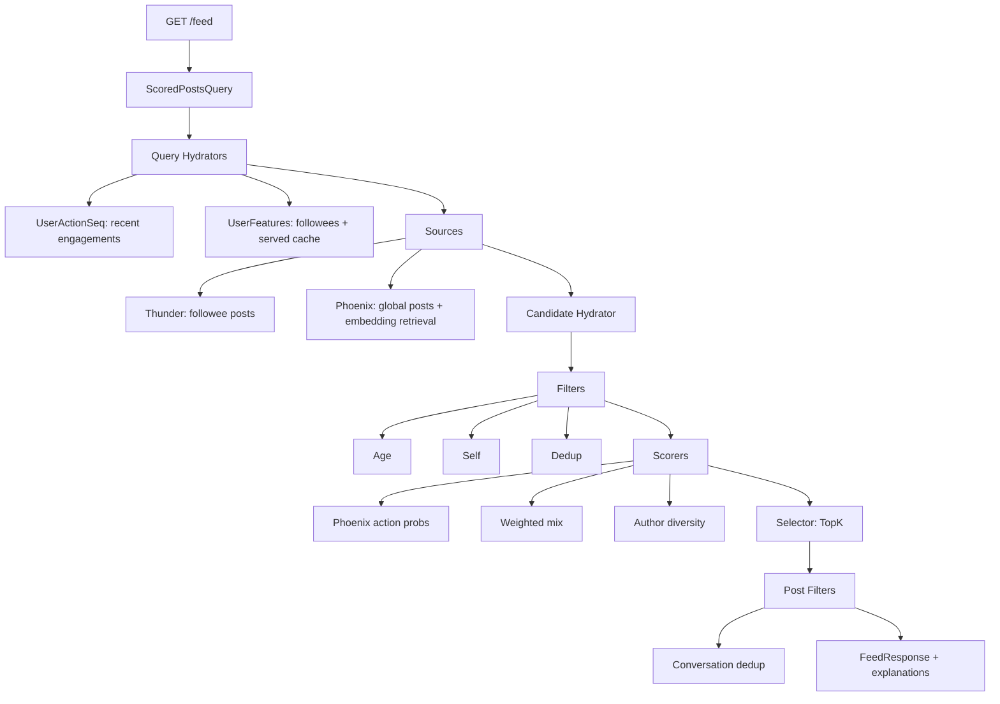

# Recommendation System Demo

Full-stack demo that reimplements a personalized "For You" ranking pipeline inspired by the open-sourced X architecture. It includes:

- Next.js (TypeScript) frontend: home feed, profiles, trends, notifications
- Python FastAPI backend with a tunable ranking pipeline and explainability
- OpenAI-powered persona + content generation
- SQLite persistence for personas, posts, engagements, and follows

## Quick Start (dev)

1) Backend

```bash
cd backend
python -m venv .venv
source .venv/bin/activate
pip install -r requirements.txt
python -m app.seed
uvicorn app.main:app --reload
```

2) Frontend

```bash
cd frontend
npm install
npm run dev
```

3) Configure env

Create `backend/.env`:

```
OPENAI_API_KEY=your_key
OPENAI_MODEL=gpt-4o-mini
OPENAI_EMBEDDING_MODEL=text-embedding-3-small
```

Create `frontend/.env.local`:

```
NEXT_PUBLIC_API_URL=http://localhost:8000
```

## Notes

- Ranking pipeline stages: query hydration, candidate sourcing, filtering, scoring, diversity, selection, post-filtering
- Preference sliders control weights for recency/popularity, friends/global, niche/viral, and topic weights
- Each post includes a transparent explanation of why it appears
- SQLite data lives in `database/data.db`

### Algorithm Flow


